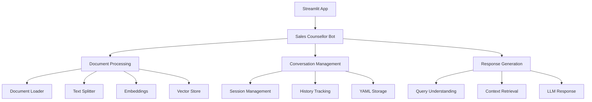
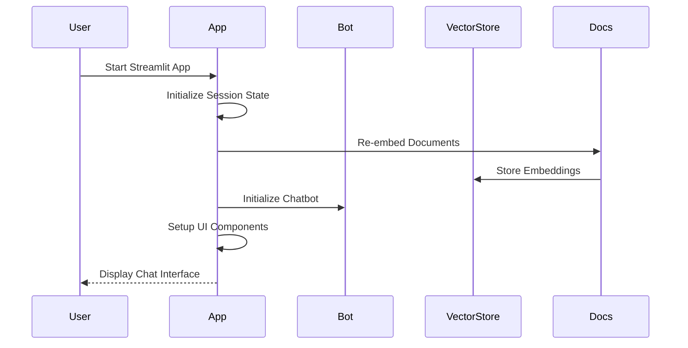
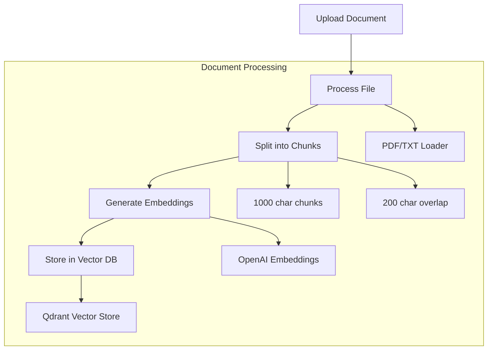
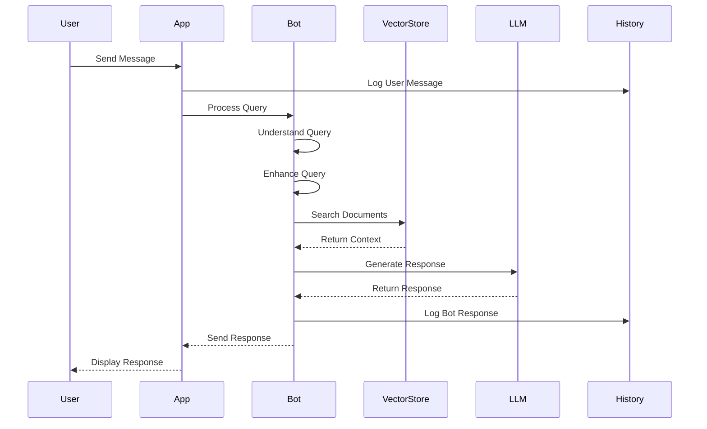

# Sales Counsellor Bot 🤖

A RAG-based chatbot for sales counselling, built with Streamlit, LangChain, and Gemini. This bot helps potential students understand Coding Ninjas courses and make informed decisions about their learning journey.

## 🏗️ Architecture



## 📁 Project Structure

```
sales-counsellor-bot/
├── app.py                 # Main Streamlit application
├── chat/
│   └── rag_chat.py       # RAG-based chat implementation
├── embeddings/
│   └── embed_docs.py     # Document processing and embedding
├── utils/
│   ├── __init__.py
│   └── conversation_manager.py  # Conversation history management
├── prompts/
│   └── base_prompt.txt   # System prompt for the bot
├── data/                 # Document storage
├── conversation_history/ # YAML files for conversation logs
└── config/
    └── config.py         # Configuration management
```

## 🔄 Application Flow

### 1. Application Startup


### 2. Document Processing


### 3. Chat Flow


## 🛠️ Key Components

### 1. Sales Counsellor Bot (`chat/rag_chat.py`)
- **Purpose**: Core chatbot implementation using RAG
- **Key Features**:
  - Query understanding and enhancement
  - Document retrieval
  - Response generation
  - Conversation management

```python
class SalesCounsellorBot:
    def __init__(self):
        # Initialize components
        self.initialize_chain()
        self.setup_keyword_mappings()
    
    def get_response(self, question: str, chat_history: List[Dict]):
        # Process query
        # Retrieve context
        # Generate response
```

### 2. Document Processing (`embeddings/embed_docs.py`)
- **Purpose**: Handle document ingestion and embedding
- **Features**:
  - PDF/TXT file loading
  - Text chunking
  - Embedding generation
  - Vector store management

### 3. Conversation Manager (`utils/conversation_manager.py`)
- **Purpose**: Manage conversation history
- **Features**:
  - Session management
  - YAML-based storage
  - Timestamp tracking
  - Message logging

### 4. Main Application (`app.py`)
- **Purpose**: Streamlit web interface
- **Features**:
  - Chat interface
  - Document management
  - Session handling
  - Error management

## 🔧 Configuration

The application uses environment variables for configuration:
```env
GOOGLE_API_KEY=your_gemini_api_key
OPENAI_API_KEY=your_openai_api_key
QDRANT_URL=your_qdrant_url
QDRANT_API_KEY=your_qdrant_api_key
QDRANT_COLLECTION=sales_counsellor
```

## 🚀 Getting Started

1. **Setup Environment**:
   ```bash
   python -m venv venv
   source venv/bin/activate  # or `venv\Scripts\activate` on Windows
   pip install -r requirements.txt
   ```

2. **Configure Environment**:
   - Copy `.env.example` to `.env`
   - Fill in your API keys

3. **Run the Application**:
   ```bash
   streamlit run app.py
   ```

## 📝 Conversation History

Conversations are stored in YAML format:
```yaml
session_start: "2024-03-11T15:30:00"
conversation:
  - timestamp: "2024-03-11T15:30:05"
    role: "user"
    content: "Tell me about the DA course"
  - timestamp: "2024-03-11T15:30:10"
    role: "assistant"
    content: "The Data Analytics course covers..."
session_end: "2024-03-11T15:45:00"
```

## 🔍 Key Features

1. **RAG Implementation**:
   - Document retrieval
   - Context-aware responses
   - Semantic search

2. **Conversation Management**:
   - Session tracking
   - History logging
   - YAML storage

3. **Document Processing**:
   - Automatic embedding
   - Chunk management
   - Vector storage

4. **User Interface**:
   - Clean Streamlit interface
   - Document management
   - Real-time chat
